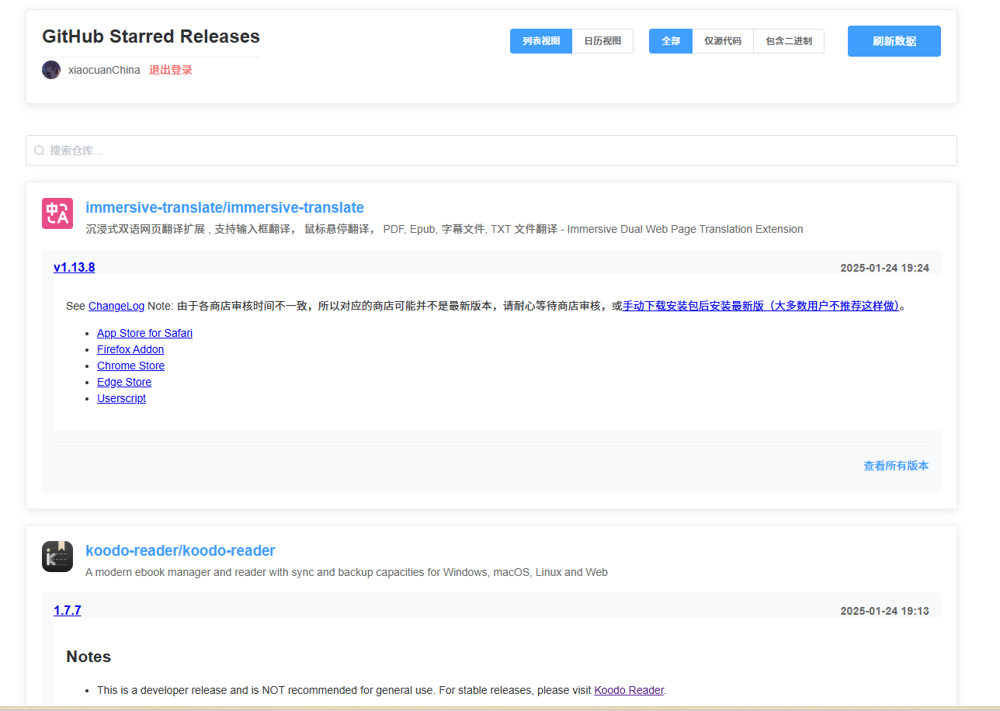

# 需要的环境

## [Node.js](https://nodejs.org/zh-cn/download)

- 需要管理不同版本的nodejs：[nodejs版本管理器](https://github.com/coreybutler/nvm-windows)

## [Python](https://www.python.org/downloads/)

## OAuth Apps

1. [Developer applications](https://github.com/settings/developers)

2. New OAuth App

   1. Application name：随便取个名字
   2. Homepage URL: http://localhost:8080
      - 这里的localhost如果部署到服务器上后可以根据自己的ip来配置
   3. Authorization callback URL: http://localhost:8080/auth/callback
      - localhost同理
   4. Register application

3. 创建成功之后点击自己刚才创建的OAuth App

4. Generate a new client secret

   - 复制这里的id

   - 再复制Client ID

5. 将 .env.example 改名为 .env 

6. 将复制的长id粘贴到GITHUB_CLIENT_SECRET后

7. 将复制的Client ID粘贴到GITHUB_CLIENT_ID后

# 安装所需依赖

~~~sh
pip install -r requirements.txt
~~~

# 运行

## 本地运行

安装完成依赖之后执行同目录下的 start.bat 文件 然后访问 http://localhost:8080/

## 服务器

~~囊中羞涩，没钱买服务器，还请各位大佬自建吧~~

# 运行效果

